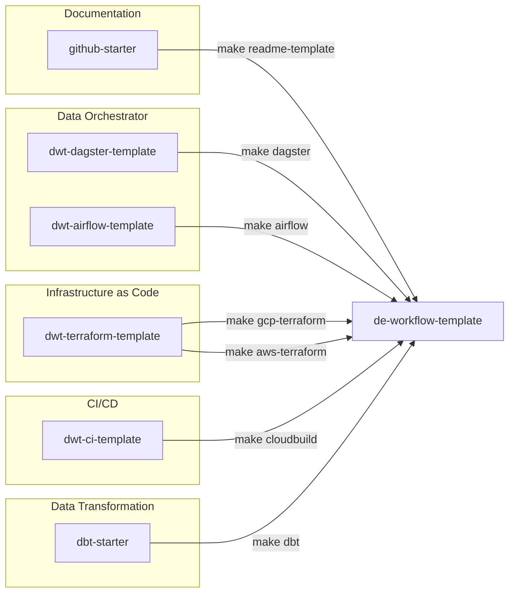

# DE Project Workflow Template
Main workflow template for jumpstarting DE projects. Consists of the following files:

1. Makefile (`workflow.mk`) to auto-import setups using the below templates
2. pre-commit config, linters, and PR templates (`.github/`)
3. Readme and `.gitignore`

## System Design
The DE Workflow template is designed to be the main repository for creating Data Engineering templates. The system is designed using a **multi-repo** setup where developers can mix and match multiple templates together to fit the needs of their project.



The system revolves around using `Makefile` to run scripts that would setup the templates automatically. Ideally, a working project can be created by just typing multiple `make` commands that build the template from scratch.

***

## Getting started
1. Create a new repo using this template (or click this [link](https://github.com/thinkingmachines/de-workflow-template/generate))
2. Ensure that these are installed in your system
    ```bash
    - direnv
    - git
    ```
3. Choose from the available `setup commands` below
4. Update `README.md`
    ```bash
    make readme-template -f workflow.mk
    ```

***
## Setup commands
- Use the primary make command found for the template you need down bellow.
- Follow the `instructions` on how to initialize the template found at the lower section above each part
#

### **Setting up your orchestrator**


***Dagster***

<sub>*Note: the commands below will create a `dagster/` directory.*</sub>
```bash
# initialize a Dagster setup
make dagster -f workflow.mk
```


***Airflow***

<sub>*Note: the commands below will create a `airflow/` directory.*</sub> (NEED CONFIRMATION - Dev Notes)
```bash
# initialize an Airflow setup
make airflow -f workflow.mk

# initialize an Airflow setup w/ DAG Builder
make airflow -f workflow.mk add_dag_builder=1
```


For further `instructions`, go to the [Dagster Template Repository](https://github.com/thinkingmachines/dwt-dagster-template#de-workflow-template-setup-recommended) or the [Airflow Template Repository](https://github.com/thinkingmachines/dwt-airflow-template#de-workflow-template-setup).
More details on Airflow [DAG Builder](https://github.com/thinkingmachines/dwt-airflow-template/blob/main/src/builder/README.md).

#
### **Setting up your Infrastructure as Code tool**

***Terraform***

<sub>*Note: the commands below will create a `terraform/` directory.*</sub>

```bash
# For GCP setups,
make gcp-terraform -f workflow.mk

# For AWS setups,
make aws-terraform -f workflow.mk
```

*Then, follow `terraform/README.md` for the initial Terraform setup.*

#
### **Setting up your CI/CD tools**


***Cloud Build as CI***
> **IMPORTANT NOTE** : **Cloud Build template needs terraform-GCP and your selected orchestrator template to already be installed**

<sub>*Note: the commands below will create a `ci/` directory and will create/append files in `terraform` folder*</sub>


```bash
# for Airflow Project
make cloudbuild cloud-platform=gcp orchestrator=airflow -f workflow.mk

# for Dagster Project
make cloudbuild cloud-platform=gcp orchestrator=dagster -f workflow.mk
```

*Then, follow the `instructions` found in [dwt-cloudbuild-template README](https://github.com/thinkingmachines/dwt-ci-template/tree/main) to set up the triggers.*

#
### **Setting up your DBT**

<sup>*Note: the command below will create a `dbt/` directory*</sup>

```bash
make dbt -f workflow.mk
```

*Then, follow the `instructions` found in [dbt-starter README](https://github.com/thinkingmachines/dbt-starter#setting-up-your-dbt-project-configs) to set up dbt adapter and environment configurations.*

***

### **Cleanup**
*Once done with setting up the project, you can choose to remove the following files from the project directory.*

```bash
rm workflow.mk
rm terraform.mk
rm ci.mk
rm terraform/README.md
rm -rf terraform/docs/
```

************
## Template Repos
These are the repositories for the underlying templates used by the De-Workflow-Template.
<pre>
<li>You may choose to use these templates directly at your discretion
<li>Additional information regarding the templates can be found in their respective repository
</pre>
Data orchestrator templates
- [Dagster](https://github.com/thinkingmachines/dwt-dagster-template)
- [Airflow](https://github.com/thinkingmachines/dwt-airflow-template)

Infrastructure as code templates
- [Terraform](https://github.com/thinkingmachines/dwt-terraform-template)

CI/CD templates
- [Cloudbuild via GCP-Terraform](https://github.com/thinkingmachines/dwt-cloudbuild-template/)

    
Data transformation templates
- [dbt](https://github.com/thinkingmachines/dbt-starter)

Documentation templates
- [Docs](https://github.com/thinkingmachines/github-starter)

#

## Other Resources
* [**Poetry wiki**](https://wiki.tm8.dev/doc/poetry-exIJa15ukh)
* [**de-commons repo**](https://github.com/thinkingmachines/de-commons)

